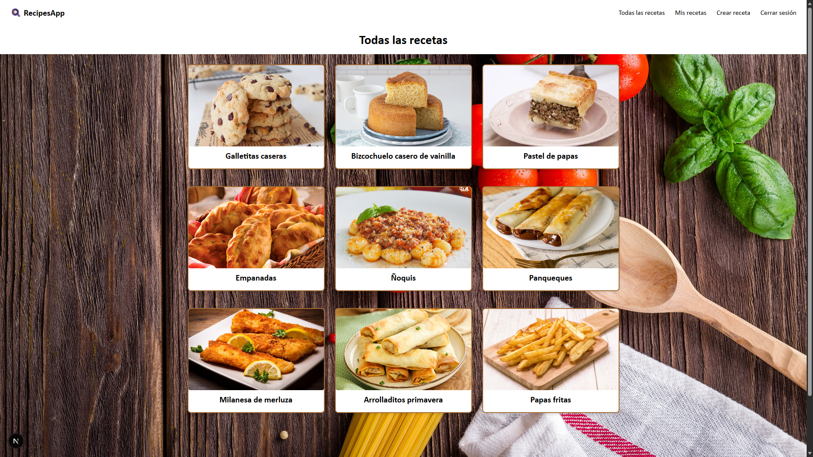

# Recipes-App
Aplicación **fullstack** para gestionar recetas de cocina, con autenticación de usuarios, CRUD de recetas, autocompletado con IA, ratings y subida de imágenes.

---

## Tecnologías utilizadas
- **Frontend:** Next.js + TypeScript + TailwindCSS  
- **Backend:** NestJS + TypeScript  
- **Base de datos:** PostgreSQL (via Prisma)  
- **Deploy:**  
  - Frontend en Vercel  
  - Backend en Render  
- **Storage:** Cloudinary para imágenes  
- **IA:** Gemini API para autocompletar recetas  

---

## Funcionalidades principales
- Registro y login de usuarios  
- CRUD de recetas (crear, editar, eliminar, listar)  
- Ratings de recetas  
- Subida de imágenes a Cloudinary  
- Autocompletar con IA (Gemini)  
- Diseño responsive 
- Compartir receta mediante un link público

---

Vista previa de la aplicación:

---

## Deploy
- **Backend:** [recipes-app-backend-huze.onrender.com](https://recipes-app-backend-huze.onrender.com/)  
- **Frontend:** [recipes-app-lean.vercel.app](https://recipes-app-lean.vercel.app/)  

>Nota: el backend en Render puede entrar en modo *sleep* por inactividad. La primera petición puede tardar unos segundos.  

---

## Instalación y configuración

Toda la información para levantar el proyecto en local se encuentra en los README específicos de cada parte:

- 📄 [Frontend README](./frontend/README.md)  
- 📄 [Backend README](./backend/README.md)

## Probar la aplicación

La aplicación ya está disponible en el deploy del frontend y se puede usar directamente sin necesidad de instalar nada en local.

Acá → https://recipes-app-lean.vercel.app

Se puede iniciar sesión con las siguientes credenciales por defecto, o crear un usuario nuevo:

- **Usuario:** `user@gmail.com`  
- **Contraseña:** `pass1234` 
